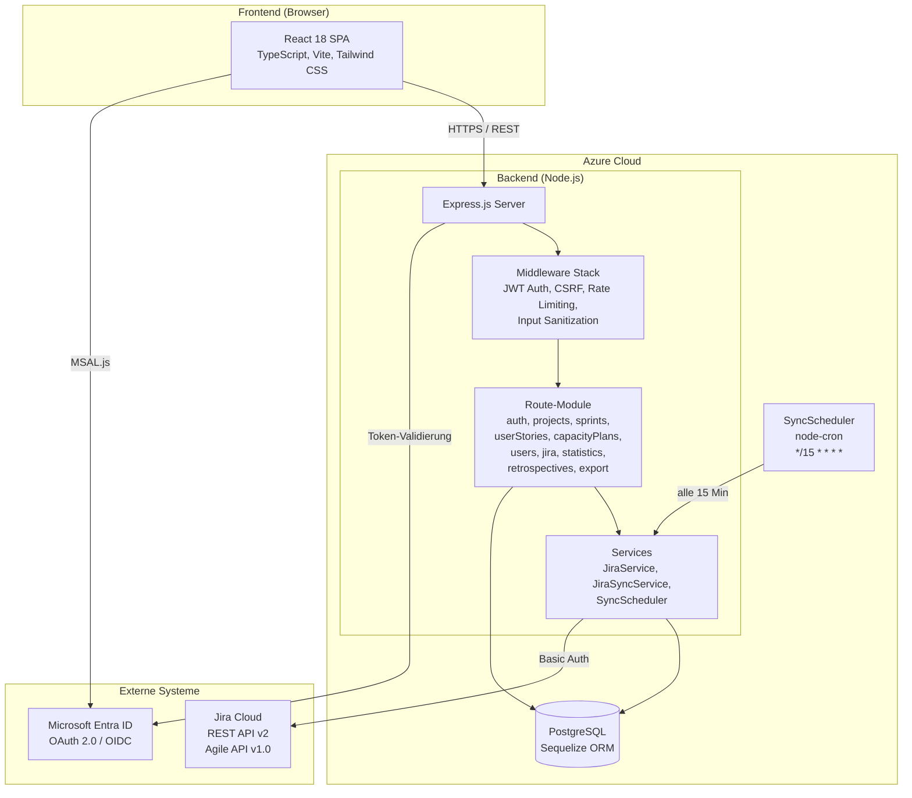
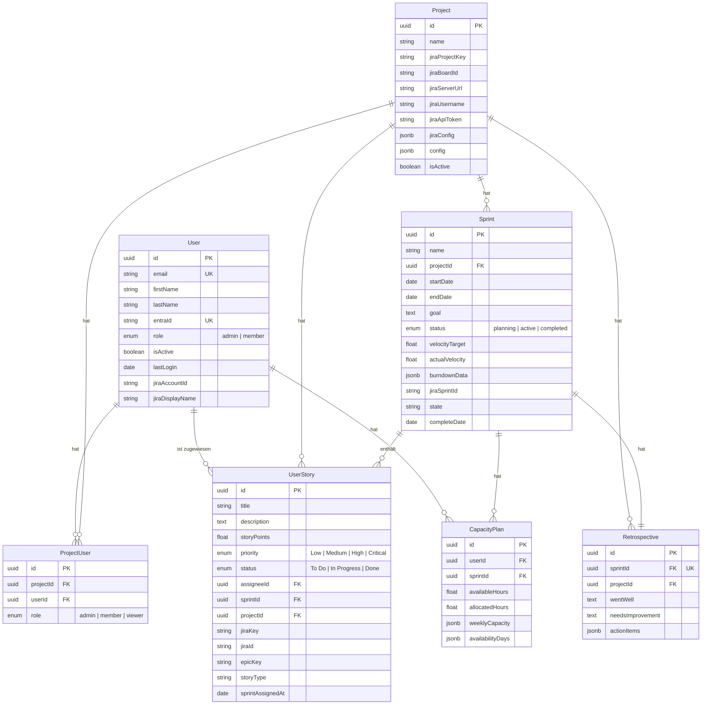
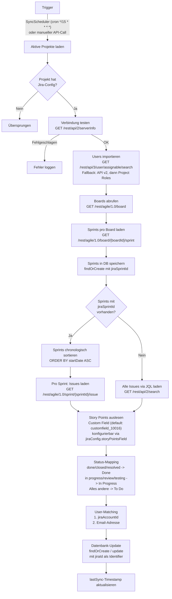

# Anhang D: Technische Dokumentation

## 1. Systemarchitektur

Die Applikation folgt einer klassischen Three-Tier-Architektur. Das Frontend ist eine statische React-SPA, die auf Azure App Service gehostet wird und per REST-API mit dem Express.js-Backend kommuniziert. Die Authentifizierung erfolgt via Microsoft Entra ID (MSAL.js im Frontend, JWT-Validierung im Backend). Die Jira-Integration nutzt Basic Auth mit API-Tokens pro Projekt, was eine Multi-Projekt-Konfiguration mit unterschiedlichen Jira-Instanzen ermöglicht.

## 2. Datenmodell

Die zentrale Beziehung ist die Many-to-Many-Verknüpfung zwischen User und Project über die Zwischentabelle ProjectUser, die eine projektspezifische Rollenzuweisung (admin, member, viewer) ermöglicht. User Stories gehören sowohl zu einem Project als auch optional zu einem Sprint, wodurch ein Backlog ohne Sprint-Zuordnung abgebildet werden kann. Jede Retrospective ist über einen Unique Constraint genau einem Sprint zugeordnet.

## 3. API-Endpunkte

| Modul | Methode | Pfad | Beschreibung |
|-------|---------|------|--------------|
| Auth | GET | `/api/auth/me` | Aktuellen User aus JWT-Token lesen |
| Projects | GET | `/api/projects` | Alle aktiven Projekte mit Mitgliedern |
| Projects | GET | `/api/projects/:id` | Einzelnes Projekt mit Mitgliedern |
| Projects | POST | `/api/projects` | Neues Projekt anlegen (Admin) |
| Projects | PUT | `/api/projects/:id` | Projekt aktualisieren (Admin) |
| Projects | POST | `/api/projects/:id/members` | Mitglied zu Projekt hinzufügen (Admin) |
| Projects | DELETE | `/api/projects/:id/members/:userId` | Mitglied aus Projekt entfernen (Admin) |
| Sprints | GET | `/api/sprints` | Sprints auflisten (Filter: projectId) |
| Sprints | GET | `/api/sprints/:id` | Sprint mit Stories und Capacity Plans |
| Sprints | POST | `/api/sprints` | Neuen Sprint anlegen |
| Sprints | PUT | `/api/sprints/:id` | Sprint aktualisieren |
| User Stories | GET | `/api/user-stories` | Stories auflisten (Filter: sprintId, projectId) |
| User Stories | GET | `/api/user-stories/:id` | Einzelne User Story mit Assignee |
| User Stories | PUT | `/api/user-stories/:id` | User Story aktualisieren |
| Capacity Plans | GET | `/api/capacity-plans` | Capacity Plans auflisten (Filter: sprintId, userId); erstellt automatisch Plans für alle Projektmitglieder |
| Capacity Plans | POST | `/api/capacity-plans` | Capacity Plan anlegen oder aktualisieren (Upsert) |
| Capacity Plans | PUT | `/api/capacity-plans/:id` | Capacity Plan aktualisieren |
| Capacity Plans | DELETE | `/api/capacity-plans/:id` | Capacity Plan löschen |
| Users | GET | `/api/users` | Alle User auflisten |
| Users | GET | `/api/users/:id` | Einzelnen User lesen |
| Users | PATCH | `/api/users/:id` | User-Rolle oder Status ändern (Admin) |
| Users | DELETE | `/api/users/:id` | User löschen inkl. Abhängigkeiten (Admin) |
| Jira | POST | `/api/jira/test-connection/:projectId` | Jira-Verbindung testen (Admin) |
| Jira | POST | `/api/jira/sync/:projectId` | Selektiver Sync: Users, Sprints, Issues (Admin) |
| Jira | POST | `/api/jira/full-sync/:projectId` | Vollständiger Sync aller Daten (Admin) |
| Jira | GET | `/api/jira/sync-status` | Status des SyncSchedulers (Admin) |
| Retrospectives | GET | `/api/retrospectives` | Retrospective für Sprint laden (Query: sprintId) |
| Retrospectives | POST | `/api/retrospectives` | Neue Retrospective anlegen |
| Retrospectives | PATCH | `/api/retrospectives/:id` | Retrospective aktualisieren |
| Statistics | GET | `/api/statistics/sprint/:sprintId` | Sprint-Statistiken (Stories, Capacity, Status/Priority Breakdown) |
| Statistics | GET | `/api/statistics/project/:projectId/velocity` | Velocity-Chart der letzten 20 abgeschlossenen Sprints |
| Statistics | GET | `/api/statistics/project/:projectId/dashboard` | Dashboard-Kennzahlen (Sprints, Stories, Completion Rate) |
| Statistics | GET | `/api/statistics/sprint/:sprintId/team-performance` | Team-Performance pro Mitglied |
| Statistics | GET | `/api/statistics/sprint/:sprintId/burndown` | Burndown-Chart (ideal + actual) |
| Statistics | GET | `/api/statistics/sprint/:sprintId/comparison` | Sprint-Vergleich mit Vorgänger und Benchmarks |
| Statistics | GET | `/api/statistics/project/:projectId/forecast` | Velocity-Forecast mit Capacity-Faktor |
| Export | GET | `/api/export/sprint/:sprintId/report` | Sprint-Report als JSON |

## 4. Frontend-Seitenstruktur

| Pfad | Komponente | Beschreibung |
|------|-----------|--------------|
| `/` | Dashboard | Projektübersicht mit KPIs, Velocity-Trend und Story-Fortschritt |
| `/sprint` | SprintView | Aktiver Sprint mit Story-Liste, Status-Board und Sprint-Statistiken |
| `/history` | SprintHistory | Chronologische Übersicht aller abgeschlossenen Sprints |
| `/analytics` | SprintAnalytics | Sprint-Vergleich, Burndown-Chart und Forecast |
| `/capacity` | CapacityPlanning | Wochenweise Kapazitätsplanung pro Teammitglied |
| `/team` | TeamMembers | Teamverwaltung mit Rollen und Jira-Zuordnung |
| `/projects` | Projects | Projektverwaltung (Erstellen, Konfigurieren, Mitglieder) |
| `/retro` | Retrospectives | Sprint-Retrospektive (Went Well, Needs Improvement, Action Items) |
| `/projects/:id/settings` | ProjectSettings | Jira-Konfiguration, Sync-Einstellungen, Projektdetails |

Die Authentifizierung wird über MSAL.js gesteuert: nicht authentifizierte User sehen ausschliesslich die Login-Seite (`LoginPage`), die einen Redirect zu Microsoft Entra ID auslöst. Alle anderen Routen sind nur innerhalb des `AuthenticatedTemplate` erreichbar.

## 5. Jira-Synchronisation

Die chronologische Sortierung der Sprints (`ORDER BY startDate ASC`) bei der Issue-Synchronisation ist ein bewusster Design-Entscheid. Wenn eine User Story in Jira mehreren Sprints zugeordnet war (z.B. durch Sprint-Überläufe), wird sie durch die aufsteigende Verarbeitung dem letzten Sprint zugewiesen, in dem sie auftaucht. Da `importUserStories` den `sprintId` bei jedem Update überschreibt, gewinnt der chronologisch letzte Sprint — was dem aktuellen Zustand in Jira entspricht.

Das Story-Points-Feld ist pro Projekt konfigurierbar (Standard: `customfield_10016`), da Jira-Instanzen unterschiedliche Custom Fields verwenden. Der User-Import nutzt eine dreistufige Fallback-Strategie: zuerst die v3-API, dann v2, und als letzten Ausweg die Project-Roles-API, um maximale Kompatibilität mit unterschiedlichen Jira-Cloud-Konfigurationen zu gewährleisten.
