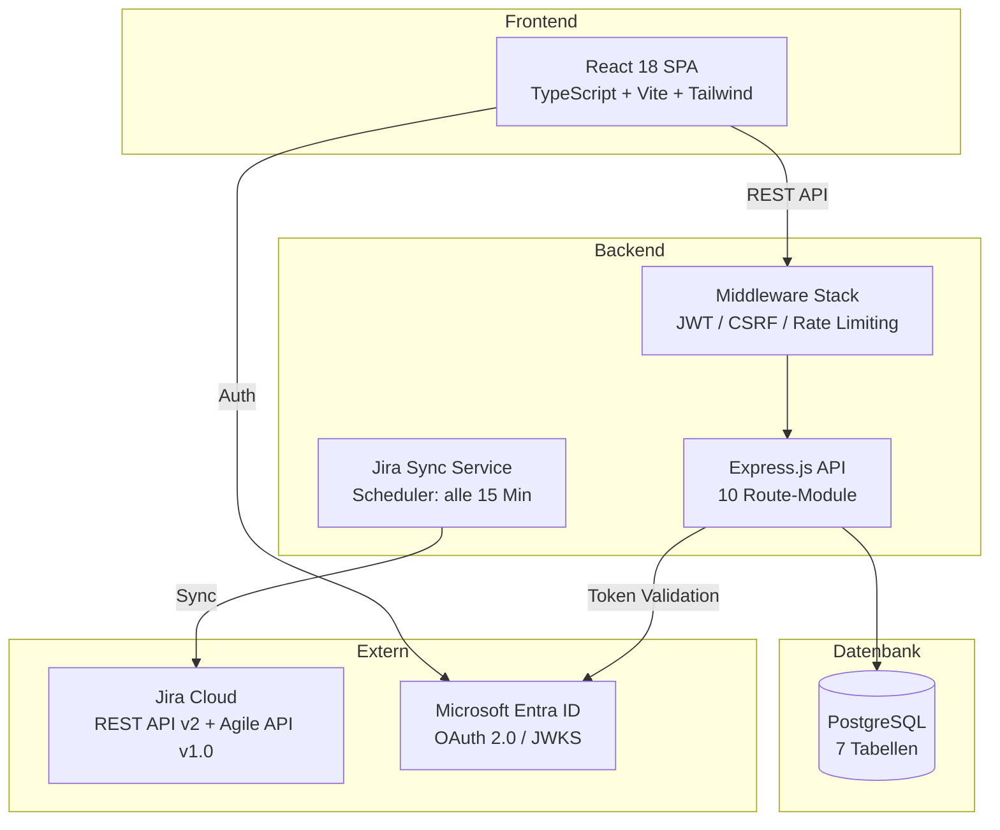
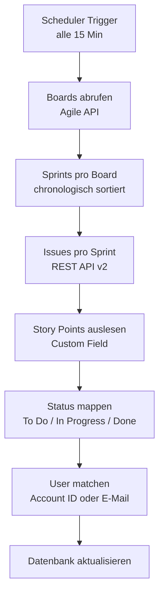

# Diplomarbeit-Dokumentation vervollständigen — Implementation Plan

> **For agentic workers:** REQUIRED: Use superpowers:subagent-driven-development (if subagents available) or superpowers:executing-plans to implement this plan. Steps use checkbox (`- [ ]`) syntax for tracking.

**Goal:** Alle fehlenden Pflichtbestandteile des SIW-Abstracts erstellen und das bestehende Abstract ergänzen, damit es den formalen Anforderungen des Leitfadens V2.7 entspricht.

**Architecture:** 4 parallele Tasks die jeweils ein eigenständiges Markdown-Dokument erzeugen/erweitern. Task 1 modifiziert das bestehende Abstract. Tasks 2-4 erstellen neue Anhang-Dateien. Alle Dokumente sind auf Deutsch.

**Tech Stack:** Markdown-Dateien, Mermaid-Diagramme für Architektur/ER-Diagramme

**Wichtige Kontextdateien:**
- `docs/Abstract_Sprintify.md` — bestehendes Abstract (175 Zeilen)
- `docs/Praesentation_Sprintify.md` — bestehende Präsentation (437 Zeilen)
- `docs/SIW_Diplomprüfung_Leitfaden_V2.7.pdf` — formale Anforderungen
- `docs/Würdigungskriterien.txt` — Bewertungskriterien
- `backend/src/models/` — Datenbankmodelle (für technische Doku)
- `backend/src/routes/` — API-Routen (für technische Doku)
- `backend/src/services/` — Services (für technische Doku)
- `frontend/src/components/` — React-Komponenten (für technische Doku)

**Sprache:** Alle Dokumente auf Deutsch verfassen. Fachbegriffe (Sprint, Velocity, Story Points, Burndown) bleiben auf Englisch.

---

## Chunk 1: Abstract erweitern

### Task 1: Abstract_Sprintify.md erweitern

**Files:**
- Modify: `docs/Abstract_Sprintify.md`

Dieses Task erweitert das bestehende Abstract um alle fehlenden formalen Bestandteile.

- [ ] **Step 1: Kapitel 3 "Aktuelle Trends" anreichern**

Das bestehende Kapitel 3 ist zu dünn. Ergänze 2-3 Absätze mit Quellenverweisen:
- Verweis auf den offiziellen Scrum Guide (Schwaber & Sutherland, 2020) bezüglich Velocity als Planungswerkzeug
- Verweis auf Atlassian Jira REST API Dokumentation als technische Grundlage
- Kurzer Absatz über den Trend zu datenbasierter Sprint-Planung vs. Bauchgefühl

Einfügen nach dem bestehenden Text in Kapitel 3, vor Kapitel 4.

- [ ] **Step 2: Abbildungsreferenzen im Text einfügen**

An folgenden Stellen im Abstract Abbildungsreferenzen einfügen:

1. In Kapitel 4.1 nach "Die API besteht aus 10 Route-Modulen...":
   → `(siehe Abbildung 1: Systemarchitektur)`

2. In Kapitel 4.1 nach "Die Datenbank hat sieben Modelle...":
   → `(siehe Abbildung 2: Datenmodell)`

3. In Kapitel 4.3 nach der SP-Empfehlungsformel:
   → `(siehe Abbildung 3: Kapazitätsplanungsansicht)`

4. In Kapitel 4.4 nach "ein Burndown-Chart":
   → `(siehe Abbildung 4: Sprint Analytics — Burndown-Chart)`

- [ ] **Step 3: Abbildungsverzeichnis einfügen**

Nach dem Abkürzungsverzeichnis und vor Kapitel 1 einfügen:

```markdown
## Abbildungsverzeichnis

| Nr. | Bezeichnung | Seite |
|-----|------------|-------|
| Abbildung 1 | Systemarchitektur Sprintify | [Seite] |
| Abbildung 2 | Datenmodell (Entity-Relationship-Diagramm) | [Seite] |
| Abbildung 3 | Kapazitätsplanungsansicht mit SP-Empfehlung | [Seite] |
| Abbildung 4 | Sprint Analytics — Burndown-Chart | [Seite] |

*Hinweis: Seitenzahlen werden im finalen PDF-Layout ergänzt.*
```

- [ ] **Step 4: Quellenverzeichnis einfügen**

Nach der Kritischen Würdigung (Kapitel 6) und vor der Selbstständigkeitserklärung einfügen:

```markdown
## Quellenverzeichnis

[Schwaber2020]
Schwaber, Ken; Sutherland, Jeff: The Scrum Guide. The Definitive Guide to Scrum: The Rules of the Game. November 2020.
https://scrumguides.org/scrum-guide.html , [Zugriffsdatum ergänzen]

[Atlassian2024a]
Atlassian: Jira Cloud REST API (v2). API-Dokumentation.
https://developer.atlassian.com/cloud/jira/platform/rest/v2/ , [Zugriffsdatum ergänzen]

[Atlassian2024b]
Atlassian: Jira Software Cloud Agile REST API. API-Dokumentation.
https://developer.atlassian.com/cloud/jira/software/rest/ , [Zugriffsdatum ergänzen]

[Microsoft2024]
Microsoft: Microsoft Authentication Library (MSAL) for JavaScript. Dokumentation.
https://learn.microsoft.com/en-us/entra/identity-platform/msal-overview , [Zugriffsdatum ergänzen]

[Express2024]
OpenJS Foundation: Express.js — Fast, unopinionated, minimalist web framework for Node.js.
https://expressjs.com/ , [Zugriffsdatum ergänzen]

[React2024]
Meta Platforms: React — A JavaScript library for building user interfaces.
https://react.dev/ , [Zugriffsdatum ergänzen]

[Sequelize2024]
Sequelize: Sequelize ORM — Feature-rich ORM for Node.js.
https://sequelize.org/ , [Zugriffsdatum ergänzen]
```

- [ ] **Step 5: Anhang-Verweise einfügen**

Nach dem Quellenverzeichnis und vor der Selbstständigkeitserklärung:

```markdown
## Anhänge

- **Anhang A:** Theorie- und Methodenreflexion
- **Anhang B:** Wirtschaftlichkeit
- **Anhang C:** Visierter Antrag zur Diplomarbeit *(vom Auftraggeber & Studiengangleiter unterschrieben — separat beilegen)*
- **Anhang D:** Technische Dokumentation (Architektur, Datenmodell, API-Übersicht)
```

- [ ] **Step 6: Commit**

```bash
git add docs/Abstract_Sprintify.md
git commit -m "docs: Abstract um Quellenverzeichnis, Abbildungsverzeichnis und Anhang-Verweise erweitern"
```

---

## Chunk 2: Anhang A — Theorie- und Methodenreflexion

### Task 2: Anhang A erstellen

**Files:**
- Create: `docs/Anhang_A_Theorie_Methoden.md`

Pflichtanhang laut Leitfaden. Reflektiert die verwendeten Methoden und deren theoretische Grundlage.

- [ ] **Step 1: Dokument erstellen**

Erstelle `docs/Anhang_A_Theorie_Methoden.md` mit folgendem Inhalt. Der Text muss authentisch und reflektiert klingen — aus der Perspektive eines Cloud Engineers der Scrum im Arbeitsalltag nutzt und nun ein Solo-Projekt damit umgesetzt hat. Ca. 2-3 Seiten.

**Inhaltliche Vorgaben:**

1. **Einleitung** (2-3 Sätze): Dieser Anhang reflektiert die in der Diplomarbeit verwendeten Methoden und deren theoretische Grundlagen.

2. **Scrum als Vorgehensmodell** (~300 Wörter):
   - Scrum Framework kurz erklären (Rollen, Artefakte, Events) mit Verweis auf Scrum Guide [Schwaber2020]
   - Anpassungen für Ein-Mann-Projekt: keine Daily Standups, keine Retrospektiven im klassischen Sinn, aber zweiwöchige Iterationen mit Review beim Vorgesetzten
   - Reflexion: Was hat funktioniert (feste Iterationen erzwingen Standortbestimmung), was nicht (ohne Team fehlt der Feedback-Loop)
   - Velocity als Planungsinstrument: Im Scrum Guide wird Velocity nicht vorgeschrieben, ist aber in der Praxis das verbreitetste Planungswerkzeug

3. **Technologiewahl** (~200 Wörter):
   - Entscheidungsmatrix-Ansatz: Welche Kriterien wurden angelegt? (Vorwissen, Eignung für den Use Case, Community/Support, Deployment-Kompatibilität mit Azure)
   - Warum Node.js statt z.B. Python/Django oder .NET? (JavaScript-Erfahrung, async I/O passt zu API-Calls, gleiches Ökosystem für Frontend und Backend)
   - Warum PostgreSQL statt MongoDB? (Relationale Datenstruktur, Many-to-Many-Beziehungen, ACID-Transaktionen)
   - Warum React statt Angular oder Vue? (Komponentenbasiert, grosse Community, Erfahrung vorhanden)

4. **Iteratives Vorgehen in der Praxis** (~200 Wörter):
   - Wie die 4 Phasen (Analyse, Backend, Frontend, Integration) konkret abliefen
   - Beispiel für eine Iteration: Jira-Integration musste in Sprint 7-8 begonnen und in Sprint 9-10 überarbeitet werden, weil die Konfigurationsvielfalt unterschätzt wurde
   - Erkenntnis: Prototyping/Spikes bei Integrationen sind kritisch

5. **Fazit** (3-4 Sätze): Was die Methodenwahl für zukünftige Projekte bedeutet. Iteratives Vorgehen hat sich bewährt, Scrum auch als Solo-Entwickler sinnvoll (mit Anpassungen), Spike-Prototypen für Integrationen einplanen.

- [ ] **Step 2: Commit**

```bash
git add docs/Anhang_A_Theorie_Methoden.md
git commit -m "docs: Anhang A — Theorie- und Methodenreflexion erstellen"
```

---

## Chunk 3: Anhang B — Wirtschaftlichkeit

### Task 3: Anhang B erstellen

**Files:**
- Create: `docs/Anhang_B_Wirtschaftlichkeit.md`

Pflichtanhang laut Leitfaden. Stellt Kosten und Nutzen von Sprintify gegenüber.

- [ ] **Step 1: Dokument erstellen**

Erstelle `docs/Anhang_B_Wirtschaftlichkeit.md`. Ca. 1.5-2 Seiten. Die Zahlen sollen plausibel und konservativ sein.

**Inhaltliche Vorgaben:**

1. **Einleitung** (2 Sätze): Wirtschaftliche Betrachtung der Entwicklung und des Betriebs von Sprintify.

2. **Entwicklungskosten** (~150 Wörter):
   - Zeitaufwand: 12 Monate, geschätzt ca. 400-500 Stunden Eigenleistung (neben dem regulären Arbeitspensum)
   - Keine Lizenzkosten für Entwicklungstools (VS Code, Node.js, PostgreSQL — alles Open Source)
   - Keine externen Dienstleister

3. **Laufende Betriebskosten** (~150 Wörter):
   - Azure App Service: Geschätzte monatliche Kosten für einen B1-Plan (~CHF 15-30/Monat)
   - Azure Database for PostgreSQL Flexible Server: (~CHF 20-40/Monat)
   - Entra ID: In bestehender Microsoft 365 Lizenz enthalten
   - Gesamt: ca. CHF 40-70/Monat bzw. CHF 480-840/Jahr
   - Zum Vergleich: Kommerzielle Alternativen wie Tempo Timesheets kosten ca. CHF 10/User/Monat → bei 8 Teammitgliedern = CHF 960/Jahr, nur für Zeiterfassung ohne Kapazitätsplanung

4. **Nutzen** (~200 Wörter):
   - Quantifizierbar: Zeitersparnis bei Sprint-Planung. Vorher: ca. 30-45 Min pro Sprint für Excel-Pflege und manuelle Kapazitätsberechnung pro Person → bei 8 Personen und 26 Sprints/Jahr = ca. 50-80 Stunden/Jahr
   - Quantifizierbar: Weniger verfehlte Sprint-Ziele → weniger Nacharbeit und Re-Planung (schwer exakt zu beziffern, aber konservativ 1-2 Stunden pro Sprint = 26-52 Stunden/Jahr)
   - Qualitativ: Datenbasierte Entscheidungen statt Bauchgefühl, bessere Transparenz im Team, historische Velocity-Daten als Argumentationsgrundlage gegenüber Stakeholdern

5. **Kosten-Nutzen-Verhältnis** (~100 Wörter):
   - Entwicklungskosten sind Einmalkosten (bereits investiert als Diplomarbeit)
   - Laufende Kosten: ca. CHF 600/Jahr (Mittelwert)
   - Geschätzte Zeitersparnis: 80-130 Stunden/Jahr
   - Bei einem internen Stundensatz von CHF 120 entspricht das CHF 9'600-15'600/Jahr eingesparte Opportunitätskosten
   - ROI im ersten Betriebsjahr: positiv
   - Zusätzlich: Sprintify ersetzt keine kostenpflichtige Lizenz, sondern Excel — der direkte Kostenvergleich ist daher die Azure-Hosting-Kosten vs. den Produktivitätsgewinn

6. **Fazit** (2-3 Sätze): Die Investition amortisiert sich bereits im ersten Betriebsjahr. Der grösste Nutzen liegt nicht in direkten Kosteneinsparungen, sondern in der verbesserten Planungsqualität.

- [ ] **Step 2: Commit**

```bash
git add docs/Anhang_B_Wirtschaftlichkeit.md
git commit -m "docs: Anhang B — Wirtschaftlichkeit erstellen"
```

---

## Chunk 4: Anhang D — Technische Dokumentation

### Task 4: Anhang D erstellen

**Files:**
- Create: `docs/Anhang_D_Technische_Dokumentation.md`
- Read: `backend/src/models/index.js` (für Datenmodell)
- Read: `backend/src/routes/*.js` (für API-Übersicht)
- Read: `backend/src/services/*.js` (für Service-Beschreibungen)
- Read: `frontend/src/App.tsx` (für Frontend-Struktur)

Fakultativer Anhang, aber sehr wertvoll für die Experten und als Nachweis der technischen Tiefe.

- [ ] **Step 1: Code lesen und Diagramme ableiten**

Lies folgende Dateien und extrahiere daraus die technischen Details:
- `backend/src/models/index.js` → Alle Modelle und Assoziationen
- `backend/src/routes/*.js` → Alle API-Endpunkte mit HTTP-Methode und Pfad
- `backend/src/services/JiraService.js` → Jira-Sync-Logik
- `backend/src/services/JiraSyncService.js` → Sync-Scheduler
- `frontend/src/App.tsx` → Frontend-Routing
- `frontend/src/types/index.ts` → TypeScript-Typen

- [ ] **Step 2: Dokument erstellen**

Erstelle `docs/Anhang_D_Technische_Dokumentation.md` mit folgendem Aufbau. Ca. 3-4 Seiten.

**Inhaltliche Vorgaben:**

1. **Systemarchitektur** — Mermaid-Diagramm:



2. **Datenmodell** — Mermaid ER-Diagramm basierend auf den tatsächlichen Modellen aus `models/index.js`. Alle Felder, Typen und Beziehungen korrekt abbilden.

3. **API-Endpunkte** — Tabelle mit allen Endpunkten:

| Modul | Methode | Pfad | Beschreibung |
|-------|---------|------|-------------|
| Auth | GET | /api/auth/me | Aktueller Benutzer |
| ... | ... | ... | ... |

Alle Endpunkte aus den Route-Dateien extrahieren.

4. **Frontend-Seitenstruktur** — Tabelle der Routen aus App.tsx:

| Pfad | Komponente | Beschreibung |
|------|-----------|-------------|
| / | Dashboard | Projektübersicht |
| ... | ... | ... |

5. **Jira-Synchronisation** — Flowchart als Mermaid-Diagramm:



- [ ] **Step 3: Commit**

```bash
git add docs/Anhang_D_Technische_Dokumentation.md
git commit -m "docs: Anhang D — Technische Dokumentation erstellen"
```

---

## Execution Notes

**Parallelisierung:** Tasks 1-4 sind voneinander unabhängig und können parallel von separaten Agents ausgeführt werden.

**Abhängigkeiten:**
- Task 4 muss den Code lesen (backend/src/models, routes, services + frontend/src)
- Task 1 referenziert Quellen die in Step 4 definiert werden — das Quellenverzeichnis wird innerhalb desselben Tasks erstellt, daher keine Abhängigkeit

**Nach Abschluss aller Tasks:**
- Alle Dateien committen
- User informieren über:
  - Welche Platzhalter noch manuell ergänzt werden müssen ([Zugriffsdatum], [Seite], Screenshots)
  - Dass Anhang C (visierter Antrag) selbst eingescannt werden muss
  - Dass das finale Layout in Word/PDF erfolgen muss
